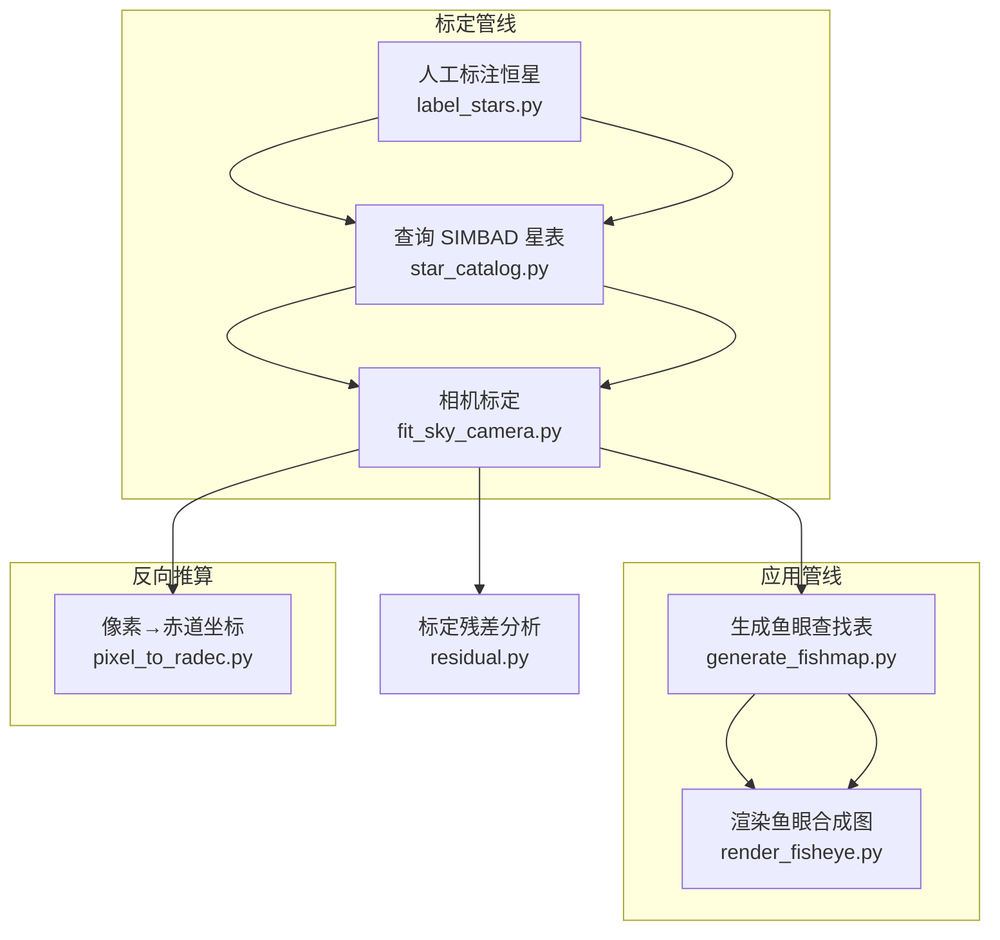

# Meteor — 多相机鱼眼天空监测系统

多相机鱼眼全天空监测系统，用于流星等天文现象的自动观测与标定。系统部署在上海市复旦大学邯郸校区（31.3°N, 121.5°E），由 6 台搭载广角镜头的相机组成，覆盖全天空视野。

## 管线总览



## 坐标系说明

| 坐标系 | 描述 | 约定 |
|--------|------|------|
| **像素坐标** (u, v) | 原始图像的列、行坐标 | 左上角原点，x 向右，y 向下 |
| **相机坐标系** | 相机为中心，光轴为 +z | x=右, y=下, z=光轴方向 |
| **世界坐标系** | 站心地平系 | x=东, y=北, z=天顶 |
| **地平坐标系** (Az, Alt) | 方位角 / 高度角 | Az 从北顺时针计量 (E of N) |
| **赤道坐标系** (RA, Dec) | ICRS 国际天球参考系 | RA 时角, Dec 角度 |

### 大气折射

- `fit_sky_camera.py` 中的 `star_altaz()` 使用 **pressure=1013 hPa, temperature=25°C** — 含大气折射
- `pixel_to_radec.py` 同时输出**视位置**（含折射）和**几何位置**（无折射, pressure=0），方便对比折射量
- 折射量通常在地平高度 <10° 时开始显著，天顶处为 0

### 站心坐标系

所有坐标均基于**站心 (topocentric)** 计算 — 以观测站点为原点的本地地平坐标系，包括 `AltAz` 变换。

## 安装与依赖

### 环境要求

- Python ≥ 3.11
- [conda](https://docs.conda.io/) 建议使用

### 安装步骤

```bash
# 创建 conda 环境
conda create -n meteor python=3.11
conda activate meteor

# 安装依赖
pip install numpy scipy pandas astropy astroquery
pip install opencv-python matplotlib
```

### 依赖清单

| 包 | 用途 |
|------|---------|
| `numpy` | 数值计算 |
| `scipy` | 非线性优化 (`least_squares`) |
| `pandas` | CSV 数据处理 |
| `astropy` | 坐标系转换 (AltAz ↔ ICRS) |
| `astroquery` | SIMBAD 星表查询 |
| `opencv-python` | 图像处理与渲染 |
| `matplotlib` | 残差可视化 |

## 脚本说明

### 1. `label_stars.py` — 交互式恒星标注

在原始图像上通过鼠标点击标注恒星，并自动进行亚像素质心精化。

```bash
python label_stars.py --cam 1
```

**操作方式：**
- 鼠标左键点击：标注恒星位置（自动显示局部放大窗口）
- 输入恒星名称后按 Enter 确认
- 按 `u` 撤销上一个标注
- 标注结果保存到 `observations.csv`

**输出：** `observations.csv` — 格式 `camera,star,x,y`

### 2. `star_catalog.py` — SIMBAD 星表查询

从 `observations.csv` 中提取恒星名称列表，通过 [SIMBAD](https://simbad.u-strasbg.fr/simbad/) 查询 RA/Dec 坐标。

```bash
python star_catalog.py
```

**参数：**
| 参数 | 默认值 | 说明 |
|------|--------|------|
| `--csv` | `observations.csv` | 输入 CSV |
| `--out` | `star_catalog.json` | 输出 JSON 星表 |

**输出：** `star_catalog.json` — `{"星名": {"ra_deg": float, "dec_deg": float}, ...}`

### 3. `fit_sky_camera.py` — 相机标定

拟合鱼眼镜头径向畸变模型 + 每台相机的姿态参数。

**数学模型：**
```
r(θ) = b₁·θ + b₃·θ³ + b₅·θ⁵    (等距鱼眼投影)
```

每台相机 5 个自由度：光轴偏移 (dcx, dcy) + 姿态 (Az, Alt, Roll)

```bash
python fit_sky_camera.py
```

**关键参数：**
| 参数 | 默认值 | 说明 |
|------|--------|------|
| `--obs` | `observations.csv` | 标注 CSV |
| `--catalog` | `star_catalog.json` | 星表 JSON |
| `--obs_time` | `2026-06-09T16:00:00`（必填） | 观测时间 (UTC, ISO 格式) |
| `--lat` | `31.3`（必填） | 观测点纬度 (°) |
| `--lon` | `121.5`（必填） | 观测点经度 (°) |
| `--height_m` | `33.0`（必填） | 观测点海拔 (m) |
| `--image_w` | `2560` | 图像宽度 (px) |
| `--image_h` | `1440` | 图像高度 (px) |
| `--max_nfev` | `500` | 优化最大迭代次数 |
| `--out` | `calibration_result.json` | 输出标定文件 |
| `--debug` | — | 输出详细误差 |

**输出：** `calibration_result.json`

### 4. `fit_sky_camera_lite.py` — 轻量标定

固定全局模型参数（径向畸变），仅优化每台相机的姿态。适用于已有准确全局标定后快速重算相机指向。

```bash
python fit_sky_camera_lite.py \
    --obs observations_lite.csv \
    --catalog star_catalog_lite.json \
    --obs_time "2026-06-01T15:00:00"
```

### 5. `generate_fishmap.py` — 生成鱼眼查找表

根据标定数据生成二进制鱼眼查找表，将输出鱼眼图的每个像素映射到对应原始图像坐标。

```
查找表格式 (fishmap.bin v4):
  header: magic("FISH") + version(u32) + width(u32) + height(u32) + max_cam(u32) = 20B
  data:   width×height × (1 + max_cam×3) × f32
          每个像素: (count, cam0, u0, v0, cam1, u1, v1, ...)
          count = 可见相机数, cam=-1 空槽位
```

```bash
python generate_fishmap.py
```

**参数：**
| 参数 | 默认值 | 说明 |
|------|--------|------|
| `--calib` | `calibration_result_6-1.json` | 标定 JSON |
| `--size` | `3000` | 输出鱼眼图尺寸 (方形, px) |
| `--image_w` | `2560` | 原始图像宽度 |
| `--image_h` | `1440` | 原始图像高度 |
| `--max_zenith` | `80` | 最大天顶角 (°) |
| `--tile_size` | `512` | 分块处理尺寸 (px) |
| `--out` | `fishmap.bin` | 输出查找表路径 |

**输出：** `fishmap.bin` — 二进制查找表

### 6. `render_fisheye.py` — 渲染鱼眼合成图

使用查找表和 N 张原始相机图像渲染全景鱼眼合成图。

**处理流程：**
1. **亮度/白平衡归一化** — 所有图像统一到相同的全局 per-channel 均值
2. **距离羽化融合** — 相机覆盖区边缘权重平滑降至 0，重叠区自动归一化
3. **径向平衡** — 补偿鱼眼径向亮度衰减
4. **水平翻转** — 输出镜像翻转（东/西方向修正）

```bash
python render_fisheye.py
```

**参数：**
| 参数 | 说明 |
|------|------|
| `--map` | 查找表路径 |
| `--images` | 直接指定图像列表 |
| `--image_dir` | 自动从目录发现图像 |
| `--n_cam` | 相机数量 |
| `--auto_detect` | 按文件名中的通道编号自动匹配 |
| `--feather_px` | 羽化过渡像素数 |
| `--radial_balance` | 启用径向亮度平衡 |
| `--out` | 输出路径 |

**输出：** `fisheye.png` — 全景鱼眼合成图

### 7. `pixel_to_radec.py` — 像素坐标 → 赤道坐标（反向推算）

从鱼眼图像的像素坐标反算出对应天区的赤道坐标 (RA/Dec)。

**推算链路：**
```
像素 (u,v)
  → 径向距离 r_px（相对主点）
  → 牛顿法反演 θ（r = b₁·θ + b₃·θ³ + b₅·θ⁵）
  → 相机系方向向量 v_cam
  → 世界系方向向量 v_world = R @ v_cam
  → 地平坐标 Az/Alt
  → 赤道坐标 RA/Dec（astropy 变换）
```

```bash
# 单像素模式
python pixel_to_radec.py --cam 1 --u 1280 --v 720

# 批量模式
python pixel_to_radec.py --csv pixels.csv
```

**输出信息：**
```
相机 1  像素 (764.49, 594.31):
  RA  = 123.456789°   (8h 13m 49.6s)
  Dec = 45.678901°
  ──────────────────────────────────
  视位置 (含折射):
    Az  = 180.1234°
    Alt = 35.6789°
  几何位置 (无折射):
    Az  = 180.1234°
    Alt = 35.4321°
  ──────────────────────────────────
  折射量 = 0.2468°  (14.81 arcmin)
```

**往返自检：**
```bash
python pixel_to_radec.py --cam 1 --u 764.49 --v 594.31 --check
```
输出 `误差 = 0.0000 px` 验证管线一致性。

**坐标系统计说明：**

| 字段 | 含义 |
|------|------|
| `ra_deg` / `dec_deg` | ICRS 赤道坐标（站心→ICRS 变换） |
| `az_apparent` / `alt_apparent` | 视地平坐标（含大气折射） |
| `az_geometric` / `alt_geometric` | 几何地平坐标（无大气折射） |

### 8. `residual.py` — 标定残差分析

可视化标定结果的重投影误差，帮助评估标定质量。

```bash
python residual.py
```

**输出图表：**
- 矢量箭头图 (quiver) — 每个标注点的残差方向与大小
- 残差散点图 — 按恒星亮度/位置分布
- θ 误差图 — 随天顶角变化趋势

## 数据文件说明

| 文件 | 说明 |
|------|------|
| `observations.csv` | 恒星标注数据（约 200 条，6 台相机） |
| `observations_lite.csv` | 轻量标注（每相机 2–3 星） |
| `star_catalog.json` | SIMBAD 查询的恒星 RA/Dec |
| `calibration_result.json` | 完整标定结果（全局模型 + 6 台相机姿态） |
| `calibration_result_lite.json` | 轻量标定结果 |
| `fisheye.png` | 渲染输出的鱼眼全景图 |

### `calibration_result.json` 结构

```json
{
  "model": "theta_to_radius_polynomial",
  "principal_point": { "cx": 1275.82, "cy": 720.65 },
  "radial_model": { "b1": 1836.37, "b3": -351.84, "b5": 69.41 },
  "cameras": {
    "1": {
      "principal_point_offset_px": { "dcx": -4.08, "dcy": -21.50 },
      "Az_rad": -0.044, "Alt_rad": 0.542, "Roll_rad": -0.002
    },
    ...
  }
}
```

- `principal_point` — 全局光学主点 (px)
- `radial_model` — 等距投影径向畸变系数
- `cameras` — 每台相机的光轴偏移和姿态参数

## 相机布局

| 通道 | 指向 |
|------|------|
| 1 | 北 (North) |
| 2 | 东 (East) |
| 3 | 西 (West) |
| 4 | 东高 (East-high) |
| 5 | 西高 (West-high) |
| 6 | 南 (South) |

## 许可

MIT License
